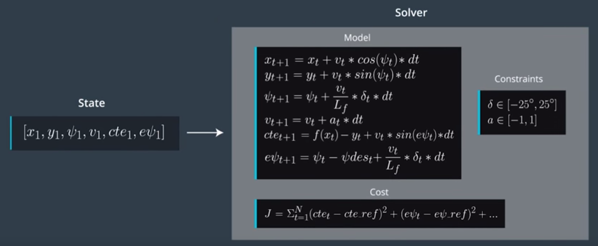

# CarND-Controls-MPC
Self-Driving Car Engineer Nanodegree Program

---

 # The model

---

### Introduction
The MPC (Model Predictive Control) controller uses a simple kinematic model which includes the following states:  

* 2-D position (x,y)
* orientation
* velocity
* crosstrack error (CTE)
* orientation error

and as outputs the controller uses the following 2 actuators:  

* steering angle
* acceleration (positive or negative)
    
Below is an analytical representation of the model and the equivalent equations:

  
  
### Timestep Length and Elapsed Duration (N & dt)
The timestep duration dt was chosen to be 0.1 sec, and the number of timesteps N was chosen to be 10.  
  
When I increased the total time (0.1sec * 10 timesteps) I observed increased instability, due to the fact that future timesteps where contributing equally in the cost function, although not so important and also increased unnecessarily the computational time.
When the total time is very small, it decreases the maximum speed that the car can drive safely, since the prediction is down for a very small distance.  
I chose the timestep duration dt to 0.1sec because it gave good enough resolution for the set reference speed and the car reached approximately **83mph** with this setup and did not tax a lot the processing speed.

I also used weight coefficients for every part of the cost function, with final values:  
  
cross track error coefficient:  w_cte = 1.0  
orientation error coefficient:  w_epsi = 200.0   
velocity difference coefficient: w_v = 1.0  
steering coefficient: w_delta = 1.0  
acceleration coefficient: w_accel = 1.0  
steering rate coefficient: w_delta_diff = 200.0  
acceleration rate coefficient: w_accel_diff = 200.0  

As you can see, I emphasised the coefficients that are related with sudden changes (derivatives), which would normally be more unacceptable. The CTE error, the speed and the steering angle are not so important therefore are not so intensively penalized. the result is very good and the car reaches easily approximately **83mph** without stepping on the outer limits of the track.  

### Polynomial Fitting and MPC Preprocessing
I chose A 3rd degree polynomial to smooth out the desired trajectory and had adequate enough, without increasing significantly the calculation load.  
It is also important to preprocess the waypoints since all the calculation are done easier into car-oriented coordinates.
Therefore all the waypoints are translated in relation to the car positioning and orientation.

### Model Predictive Control with Latency
A latency of 100ms in the actuation is introduced in the simulation, as required by the project.  
  
A simple and effective solution is to do a prediction of the car state and all the related parameters after the latency and take that into account. 
This includes:  

* The 2-D position of the car (x,y)
* The orientation of the  car
* The speed of the car
* The Crosstrack error (CTE)
* The orientation error 

One think to note is that I used the same speed, since it is not easy to accurately predict the acceleration of the car.  

### Performance
Please see below the performance of the MPC controller:

### Reflection
The performance of the MPC controller is quite good. Some more optimizations may be possible if I create a better prediction of the latency effect in the car movement. This would require a use of recent historical data to estimate variables that can not be calculated analytically in real world, due to different external conditions, such as the acceleration of the car in relation to a specific throttle value.  
  
  
